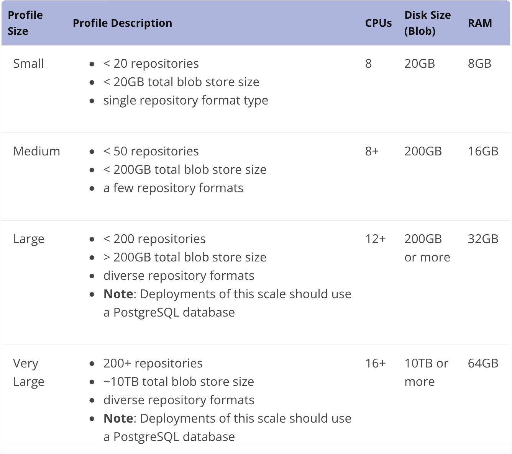
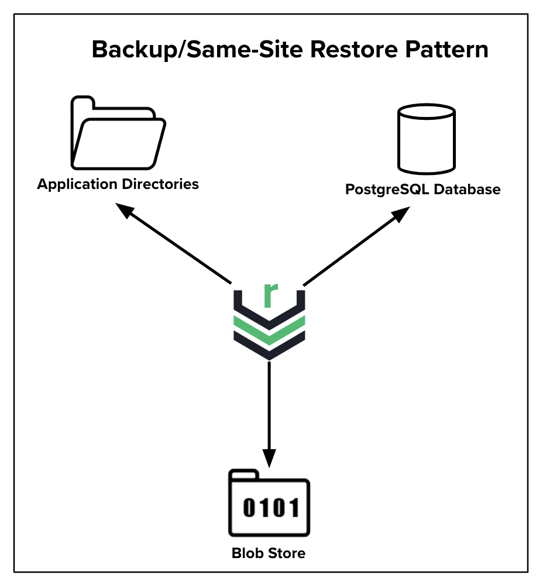
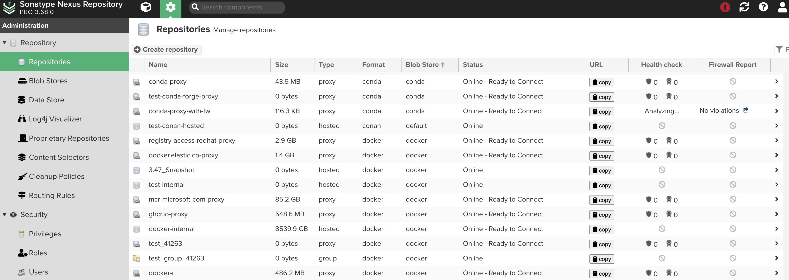

# Nexus Repo

## Table of Contents

- [Yêu cầu hệ thống của Nexus](#yêu-cầu-hệ-thống-của-nexus)
  - [Tối ưu các thông số của Nexus chạy trên Docker](#tối-ưu-các-thông-số-của-nexus-chạy-trên-docker)
  - [Giải thích về những cờ giới hạn dùng để Tuning](#giải-thích-về-những-cờ-giới-hạn-dùng-để-tuning)
    - [Giới hạn bộ nhớ](#giới-hạn-bộ-nhớ)
    - [Giới hạn CPU](#giới-hạn-cpu)
    - [Giới hạn số lượng tệp có thể mở](#giới-hạn-số-lượng-tệp-có-thể-mở)
    - [Giới hạn số lượng tiến trình](#giới-hạn-số-lượng-tiến-trình)
    - [Healthcheck](#healthcheck)
    - [Logging](#logging)
- [Đề xuất kho lưu trữ Sonatype Nexus](#đề-xuất-kho-lưu-trữ-sonatype-nexus)
- [Cấu hình cho việc triển khai HA](#cấu-hình-cho-việc-triển-khai-ha) 
- [Sao lưu](#Sao-lưu)
- [Repository Management](#Repository-Management)
- [Repository Types](#Repository-Types)
- [Formats](#Formats)
- [Blob Stores](#blob-stores)
- [Repo APT](#Repo-APT)
- [Repo Docker](#Repo-Docker)
- [Repo raw](#Repo-raw)
- [Repo yum](#Repo-yum)
- [Định dạng](#định-dạng)
- [Privileges](#privileges)
- [Routing Rules](#Routing-Rules)
- [Storage Planning](#storage-planning)

## Yêu cầu hệ thống của Nexus

- Hỗ trợ phần lớn hệ điều hành
  - Mac
  - Win
  - Linux

### Tối ưu các thông số của Nexus chạy trên Docker

- Có thể ghi đè nó trên những file docker compose
- Các thông số có thể ghi đè:
  - Giới hạn bộ nhớ:
    - `--memory`: Giới hạn tối đa bộ nhớ mà container có thể sử dụng.
    - `--memory-swap`: Thiết lập giới hạn tổng bộ nhớ (RAM + swap)
- Giới hạn CPU: - `--cpus`: Giới hạn số lượng CPU mà container có thể sử dụng. - `--cpu-shares`: Thiết lập mức độ ưu tiên CPU. - `--cpu-quota` và `--cpu-period`: Thiết lập thời gian CPU có thể sử dụng trong một khoảng thời gian cụ thể.
- Số lượng tệp có thể mở: - `--ulimit nofile`: Có thể thiết lập giới hạn số lượng tệp mà container có thể mở.
- Giới hạn số lượng tiến trình: - `--pids-limit`: Giới hạn số lượng tiến trình mà container có thể chạy.
- Giới hạn băng thông mạng: - Docker không cung cấp trực tiếp cờ để giới hạn băng thông mạng, nhưng có thể sử dụng "tc" (traffic control) để quản lý và giới hạn băng thông mạng.
- nên sử dụng bản 22.04 jammy
- 

### Giải thich về đoạn những cờ giới hạn dùng để Tuning

```docker compose
version: '3.8'

services:
  nexus:
    image: sonatype/nexus3
    container_name: nexus
    restart: always
    ports:
      - "8081:8081"
    deploy:
      resources:
        limits:
          cpus: '2.0'
          memory: '4G'
        reservations:
          cpus: '1.0'
          memory: '2G'
    ulimits:
      nofile:
        soft: 65536
        hard: 65536
    pids_limit: 500
    volumes:
      - ./nexus-data:/nexus-data
    networks:
      nexus_net:
    healthcheck:
      test: ["CMD", "curl", "-f", "http://localhost:8081"]
      interval: 1m30s
      timeout: 10s
      retries: 3
    logging:
      driver: "json-file"
      options:
        max-size: "10m"
        max-file: "3"

volumes:
  nexus-data:

networks:
  nexus_net:
    driver: hosted

```

#### Giới hạn bộ nhớ:

- `limits.memory: 4g`: Giới hạn bộ nhớ của container là 4GB.

#### Giới hạn CPU:

- `deploy.resources.limits`: Giới hạn CPU là 2.0 và bộ nhớ là 4G để đảm bảo container không sử dụng quá nhiều tài nguyên.
- `deploy.resources.reservations`: Đảm bảo container luôn có ít nhất 1.0 CPU và 2G bộ nhớ để hoạt động mượt mà.

#### Giới hạn số lượng tệp có thể mở:

- `ulimits.nofile.soft: 65536`: Giới hạn mềm cho số lượng tệp là 65536.
- `ulimits.nofile.hard: 65536`: Giới hạn cứng cho số lượng tệp là 65536.
  - **Soft limit**: Là giới hạn mà tiến trình có thể thay đổi trong phạm vi của nó, trừ khi nó đã được nâng lên đến giới hạn cứng.
  - **Hard limit**: Là giới hạn tối đa mà chỉ có người dùng có quyền root mới có thể thay đổi.

#### Giới hạn số lượng tiến trình:

- `pids_limit: 500`: Giới hạn số lượng tiến trình là 500.

#### Healthcheck:

- `healthcheck`: Kiểm tra sức khỏe của container bằng cách gửi yêu cầu curl tới http://localhost:8081. Kiểm tra này được thực hiện mỗi 1 phút 30 giây, với thời gian chờ là 10 giây và thử lại tối đa 3 lần.

#### Logging:

- `logging`: Sử dụng driver `json-file` để ghi log. Giới hạn kích thước file log là 10MB và số lượng file log là 3 để tránh việc log chiếm quá nhiều dung lượng đĩa.

### Đề xuất kho lưu trữ Sonatype Nexus

<div align="center">
  
</div>

<div align="center">
  <i> </i>
</div>

## Cấu hình cho việc triển khai HA

## Sao lưu
- <div align="center">
  
</div>

<div align="center">
  <i> </i>
</div>


- mô hình backup/same-site restore: là mô hình phổ biến và đơn giản nhất để giải quyết các mối quan tâm về tính toàn vẹn của dữ liệu. 

## Repository Management
- Là vùng chứa các thành phần (ví dụ như artifacts, packages, ….) mà các nhóm phát triển truy cập hằng ngày. Quản trị kho là một phần thiết yếu trong cấu hình của Nexus.
- Nexus có các loại:
    - Hosted
    - Proxy
    - Group
- Quyền thêm, sửa và xóa kho của mỗi người được xác định thông qua privileges được trao cho vai trò được chỉ định cho người dùng.

<div align="center">
  
</div>

<div align="center">
  <i> </i>
</div>

### Thông tin trên màn hình chính
- **Name**: Là tên duy nhất trong kho hoặc nhóm.
- **Size**: Là kích thước được tính bằng tổng của các kho chứa:
    - Nexus repo xác định kích thước blob bằng cách kéo từ giá trị kích thước được lưu trong bộ nhớ cache trong cơ sở dữ liệu.
    - Giá trị này được cập nhật 2 phút sau bất kỳ bản cập nhật nào được thêm hoặc xóa, còn cập nhật thì sẽ là 5 phút kể từ khi tải thêm một thành phần lên kho.
- **Type**: Là các loại của kho chứa.
- **Format**: Là định dạng mà kho sử dụng để lưu trữ và hiển thị ra cho người dùng. Các ví dụ bao gồm docker, npm, go, pypi, v.v. 
- **Blob Store**: Là kho blob trong đó kho lưu trữ này lưu trữ được phần nhị phân của nó.
- **Status**: Trạng thái khả dụng của kho:
    - Online - Uninitialized: Kho proxy được khởi tạo nhưng chưa sẵn sàng.
    - Online - Ready to Connect: Đã sẵn sàng kết nối từ xa.
    - Online - Remote Available: Cho biết kho lưu trữ proxy đã sẵn sàng để kết nối từ xa và yêu cầu thành công được thực hiện.
    - Online - Remote Manually Blocked: Nexus sẽ tự chặn proxy nếu không khả dụng.
    - Online - Remote Auto Blocked and Unavailable: Đã bật tự động chặn và kho lưu trữ không phản hồi.
    - Online - Remote Unavailable: Không bật tự động chặn và kho chứa không phản hồi.
    - Offline - Repository Offline.
- **URL**: Để lấy link, Maven và các công cụ khác có thể truy cập kho lưu trữ trực tiếp tại URL đó (ví dụ: http://localhost:8081/repository/maven-central).
- **Health Check**: Hiển thị thông số kết quả sức khỏe của kho.
- **Firewall Report**.

## Repository Types
### Proxy
- Là kho lưu trữ được liên kết với một kho từ xa khác.
- Khi có một yêu cầu, trước tiên nó sẽ đến kho proxy để xem có đang sẵn có ở cục bộ trong kho proxy không. Trong trường hợp không có thì sẽ tìm kiếm trong kho từ xa.
- Kho Nexus sau đó sẽ truy xuất và lưu trữ thành phần này cục bộ trong kho proxy.
- Nếu ai yêu cầu cùng một thành phần này, kho Nexus sẽ có thể tìm thấy nó trong kho cục bộ và thực hiện nó cục bộ.
- Cấu hình mặc định Nexus:
    - Maven-central
    - Nuget.org-proxy

### Hosted
- Là kho lưu trữ các thành phần trong kho lưu trữ Nexus làm vị trí có thẩm quyền cho các thành phần.
- Cấu hình mặc định:
    - maven-releases
    - maven-snapshots
    - nuget-hosted

### Group
- Là một nhóm các kho lưu trữ.
- Người dùng có thể dựa vào một URL duy nhất cho nhu cầu cấu hình của cả nhóm, thêm kho lưu trữ và thành phần của nhóm.
- Khi một người dùng được cấp quyền cho kho lưu trữ nhóm, thì người dùng đó cũng sẽ có đặc quyền đó cho tất cả các thành viên chuyển tiếp của kho lưu trữ nhóm đó chỉ khi yêu cầu của họ được chuyển đến kho lưu trữ nhóm.
- Yêu cầu thẳng đến kho chỉ hoạt động nếu người dùng được cấp quyền trong đó.
- Cấu hình mặc định:
    - maven-public
    - nuget-group

## Formats 
- **APT**: Sử dụng công cụ APT như apt-get để truy cập Debian, Ubuntu, và các gói phần mềm Linux.
- **Bower**: Theo dõi tất cả các gói phát triển giao diện người dùng trang web của bạn bằng cách sử dụng sổ đăng ký Bower. Lưu ý rằng định dạng Bower không tương thích với cơ sở dữ liệu H2 hoặc PostgreSQL.
- **CocoaPods**: Quản lý các gói CocoaPods (có thể chứa mã Swift) và các dự án Objective-C Cocoa. Lưu ý rằng không hỗ trợ trình quản lý gói Swift của Apple.
- **Conan**: Chia sẻ các gói C/C++ của bạn trong một kho lưu trữ trung tâm.
- **Conda**: Các gói Proxy Conda cho các ngôn ngữ như Python, R, Ruby, Lua, Scala, Java, JavaScript, C/C++ và FORTRAN.
- **Docker**: Proxy các Docker registries.
- **Git LFS**: Lưu trữ các tệp lớn như mẫu âm thanh, video, bộ dữ liệu và đồ họa bên trong kho lưu trữ và sử dụng các con trỏ văn bản đơn giản cho những thứ này bên trong dự án Git của bạn.
- **Go**: Lưu trữ các gói golang để xây dựng cục bộ nhanh chóng.
- **Helm**: Quản lý các gói cho Kubernetes.
- **Maven**
- **Npm**: Tạo các dự án JavaScript Node.js của bạn lên kho lưu trữ và tích hợp các gói JavaScript bên ngoài.
- **NuGet**
- **P2**
- **PyPI**: Được sử dụng cài đặt và xuất bản các gói vào kho lưu trữ PyPI.
- **R**
- **Raw**: Một định dạng linh hoạt không thực thi bất kỳ loại bố cục nào cho phép bạn lưu trữ và phục vụ bất kỳ loại nội dung nhị phân nào như các trang web Maven qua HTTP.
- **RubyGems**: Lưu trữ các gói Ruby.
- **Yum**: Hỗ trợ hạng nhất để lưu trữ và ủy quyền các bản phân phối RPM của bạn.

#### So sánh Các Loại Kho Chứa Trong Nexus Repository OSS

##### 1. APT (Advanced Package Tool)
- **Mục đích:** Quản lý các gói phần mềm trên hệ điều hành Debian và Ubuntu.
- **Định dạng:** Các gói `.deb` được tổ chức thành các kho chứa và danh sách gói (`Packages.gz`, `Release`, v.v.).
- **Điểm khác biệt nổi bật:** Tạo và quản lý kho chứa cho các hệ điều hành Debian và Ubuntu, hỗ trợ tự động cập nhật và cài đặt gói.
- **Lựa chọn tốt nhất:** Dùng khi bạn đang quản lý hệ thống Debian/Ubuntu và muốn có một kho chứa gói nội bộ hoặc tổ chức các gói riêng.

##### 2. PyPI (Python Package Index)
- **Mục đích:** Quản lý các gói phần mềm Python.
- **Định dạng:** Các gói `.tar.gz`, `.whl`, và các meta thông tin (`METADATA`, `PKG-INFO`).
- **Điểm khác biệt nổi bật:** Dùng cho môi trường Python, hỗ trợ cài đặt và cập nhật các gói Python thông qua pip.
- **Lựa chọn tốt nhất:** Dùng khi cần quản lý các gói Python và muốn có kho chứa riêng cho các dự án Python.

##### 3. Docker
- **Mục đích:** Quản lý các hình ảnh Docker (Docker images).
- **Định dạng:** Các hình ảnh Docker được lưu trữ dưới dạng các layers trong kho chứa.
- **Điểm khác biệt nổi bật:** Dùng cho việc triển khai và phân phối các container Docker, hỗ trợ quản lý và phân phối các phiên bản khác nhau của hình ảnh.
- **Lựa chọn tốt nhất:** Dùng khi cần lưu trữ và phân phối các hình ảnh Docker nội bộ hoặc tổ chức các hình ảnh riêng cho dự án.

##### 4. Raw
- **Mục đích:** Cung cấp lưu trữ đơn giản cho các tệp không thuộc bất kỳ định dạng kho chứa đặc thù nào.
- **Định dạng:** Có thể lưu trữ bất kỳ loại tệp nào mà không cần cấu trúc đặc biệt.
- **Điểm khác biệt nổi bật:** Linh hoạt trong việc lưu trữ các tệp không tuân theo định dạng chuẩn của các kho chứa khác.
- **Lựa chọn tốt nhất:** Dùng khi cần lưu trữ các tệp tạm thời hoặc không thuộc bất kỳ loại kho chứa nào.

##### 5. YUM (Yellowdog Updater, Modified)
- **Mục đích:** Quản lý các gói phần mềm trên các hệ điều hành Red Hat và các phân phối dựa trên Red Hat.
- **Định dạng:** Các gói `.rpm` và metadata (`repodata`).
- **Điểm khác biệt nổi bật:** Tạo và quản lý kho chứa cho hệ điều hành Red Hat và các hệ điều hành tương tự.
- **Lựa chọn tốt nhất:** Dùng khi bạn đang quản lý hệ thống Red Hat hoặc CentOS và muốn có kho chứa gói nội bộ hoặc tổ chức các gói riêng.

##### 6. Go
- **Mục đích:** Quản lý các module và gói Go.
- **Định dạng:** Các gói Go được lưu trữ trong các module và các tệp `.mod`, `.sum`.
- **Điểm khác biệt nổi bật:** Dùng cho việc phân phối các module Go, hỗ trợ tự động tải về và quản lý các phiên bản của các module Go.
- **Lựa chọn tốt nhất:** Dùng khi cần quản lý và phân phối các module Go cho các dự án Go.

##### 7. Helm
- **Mục đích:** Quản lý các chart Helm cho Kubernetes.
- **Định dạng:** Các chart Helm được đóng gói dưới dạng các tệp `.tgz` và các cấu hình liên quan (`Chart.yaml`, `values.yaml`).
- **Điểm khác biệt nổi bật:** Dùng cho việc triển khai và quản lý các ứng dụng Kubernetes thông qua Helm charts.
- **Lựa chọn tốt nhất:** Dùng khi cần quản lý và phân phối các chart Helm cho các ứng dụng trên Kubernetes.

##### 8. NPM (Node Package Manager)
- **Mục đích:** Quản lý các gói phần mềm JavaScript và Node.js.
- **Định dạng:** Các gói `.tgz` và metadata (`package.json`, `package-lock.json`).
- **Điểm khác biệt nổi bật:** Dùng cho môi trường Node.js, hỗ trợ quản lý và phân phối các gói JavaScript.
- **Lựa chọn tốt nhất:** Dùng khi cần quản lý và phân phối các gói JavaScript cho các dự án Node.js.

##### 9. RubyGems
- **Mục đích:** Quản lý các gói phần mềm Ruby.
- **Định dạng:** Các gói `.gem` và các meta thông tin (`gemspec`).
- **Điểm khác biệt nổi bật:** Dùng cho môi trường Ruby, hỗ trợ quản lý và phân phối các gem Ruby.
- **Lựa chọn tốt nhất:** Dùng khi cần quản lý và phân phối các gem Ruby cho các dự án Ruby.

## Repo APT
- **Apt**: Là trình quản lý gói dòng lệnh chính cho Debian và dẫn xuất của nó. Nó cung cấp các công cụ để tìm kiếm, quản lý và truy cập thông tin về các gói, cũng như quyền truy cập cấp thấp vào tất cả các tính năng được cung cấp bởi các thư viện libapt-pkg và libapt-inst mà các trình quản lý gói cao hơn có thể dựa vào.
- Sử dụng các công cụ Advanced Package Tool (APT) như `apt-get` để truy cập Debian, Ubuntu và các gói mà Linux được lưu.

### Proxy APT repo
- **APT Hosted Repository** là kho lưu trữ nơi bạn có thể lưu trữ và quản lý các gói APT của riêng mình. Đây là nơi bạn lưu trữ các gói mà bạn đã phát triển hoặc tải lên từ các nguồn bên ngoài để sử dụng nội bộ.
- các bước
    - tạo repo trên nexus
    - lấy url 
    - sửa đổi File cấu hình apt trong Linux (/etc/apt/sources.list)
``` bash
deb [trusted=yes] http://172.16.252.225:8081/repository/apt-proxy/  jammy main
deb-src [trusted=yes] http://172.16.252.225:8081/repository/apt-proxy/ jammy main 
```
- nguyên lý hoat động:
  - **Lưu trữ gói:** Bạn có thể tải lên các gói `.deb` và các metadata liên quan (như `Packages.gz` và `Release` files) vào kho lưu trữ này. Các gói được tổ chức theo cấu trúc phân phối và phiên bản.
  - **Truy xuất gói:** Người dùng và hệ thống sẽ có thể truy xuất các gói từ kho lưu trữ này thông qua URL tương ứng. Các gói có thể được tìm thấy và cài đặt dựa trên cấu hình của kho lưu trữ trong các file cấu hình APT của hệ thống.
  - **Quản lý phân phối:** Bạn cần cấu hình phân phối (`distribution`) phù hợp khi cấu hình kho lưu trữ, để gói có thể được phân phối cho các hệ thống tương thích.


### Hosted APT repo
- **APT Proxy Repository** là kho lưu trữ được cấu hình để proxy các kho lưu trữ APT bên ngoài, chẳng hạn như các kho chính thức của Debian hoặc Ubuntu. Khi có yêu cầu tải xuống gói từ một kho bên ngoài, kho proxy sẽ lưu trữ bản sao của gói đó để sử dụng lại sau này, cải thiện hiệu suất và giảm tải cho các nguồn gốc bên ngoài.
- các bước
  - tạo repo
  - tạo khoá PGP signing key pair
  - thay đổi trong cấu hình apt giống giống với apt proxy
- nguyên lý hoạt động:
  - **Proxy hóa gói:** Khi một hệ thống yêu cầu một gói từ kho lưu trữ APT bên ngoài, kho proxy sẽ gửi yêu cầu đến kho lưu trữ bên ngoài và tải gói về nếu nó chưa có trong bộ nhớ cache của kho proxy.
  - **Lưu trữ tạm thời:** Các gói được tải về sẽ được lưu trữ trong kho proxy, giúp tiết kiệm băng thông và thời gian khi các hệ thống khác yêu cầu cùng một gói.
  - **Cập nhật và đồng bộ:** Kho proxy sẽ định kỳ cập nhật và đồng bộ với kho lưu trữ bên ngoài để đảm bảo rằng các gói và metadata là mới nhất. Thông tin về các gói cũng được cache để cải thiện tốc độ truy xuất.
  - **Quản lý phân phối:** Tương tự như với các kho lưu trữ hosted, bạn cần cấu hình phân phối (`distribution`) để kho proxy có thể truy cập và lưu trữ các gói tương ứng từ các kho bên ngoài.


## Repo Docker
- Nexus hỗ trợ lưu trữ và ủy quyền các đăng ký Docker. Có thể hiển thị nhiều kho lưu trữ cho các công cụ phía máy khác trong một URL duy nhất dưới dạng nhóm kho lưu trữ. Điều này làm giảm thời gian và băng thông.

### **1. Docker Hosted Repositories**

**Docker Hosted Repository** là kho lưu trữ nơi bạn có thể lưu trữ các hình ảnh Docker của riêng mình. Đây là nơi bạn lưu trữ các hình ảnh mà bạn đã xây dựng hoặc tải lên để sử dụng nội bộ hoặc phân phối.

#### **Nguyên lý hoạt động:**

- **Lưu trữ hình ảnh:** Bạn có thể tải lên các hình ảnh Docker của mình vào kho lưu trữ này. Các hình ảnh này có thể được tổ chức theo các phiên bản và tag khác nhau.
- **Truy xuất hình ảnh:** Người dùng và hệ thống sẽ có thể truy xuất các hình ảnh từ kho lưu trữ này thông qua URL tương ứng. Các hình ảnh có thể được tìm thấy và kéo xuống dựa trên tag của hình ảnh.
- **Quản lý phân phối:** Khi cấu hình kho lưu trữ, bạn có thể định nghĩa các chính sách quản lý hình ảnh, chẳng hạn như chính sách xóa hoặc hạn chế dung lượng.

### **2. Docker Proxy Repositories**

**Docker Proxy Repository** là kho lưu trữ được cấu hình để proxy các kho lưu trữ Docker bên ngoài, chẳng hạn như Docker Hub hoặc các kho chính thức khác. Khi có yêu cầu tải xuống một hình ảnh từ kho bên ngoài, kho proxy sẽ lưu trữ bản sao của hình ảnh đó để sử dụng lại sau này, giúp cải thiện hiệu suất và giảm tải cho các nguồn gốc bên ngoài.

#### **Nguyên lý hoạt động:**

- **Proxy hóa hình ảnh:** Khi một hệ thống yêu cầu một hình ảnh từ kho lưu trữ Docker bên ngoài, kho proxy sẽ gửi yêu cầu đến kho lưu trữ bên ngoài và tải hình ảnh về nếu nó chưa có trong bộ nhớ cache của kho proxy.
- **Lưu trữ tạm thời:** Các hình ảnh được tải về sẽ được lưu trữ trong kho proxy, giúp tiết kiệm băng thông và thời gian khi các hệ thống khác yêu cầu cùng một hình ảnh.
- **Cập nhật và đồng bộ:** Kho proxy sẽ định kỳ cập nhật và đồng bộ với kho lưu trữ bên ngoài để đảm bảo rằng các hình ảnh và metadata là mới nhất. Thông tin về các hình ảnh cũng được cache để cải thiện tốc độ truy xuất.
- **Quản lý phân phối:** Tương tự như với các kho lưu trữ hosted, bạn cần cấu hình phân phối (`distribution`) để kho proxy có thể truy cập và lưu trữ các hình ảnh tương ứng từ các kho bên ngoài.

### **Kết nối với Docker Repositories từ Ubuntu**

Để kết nối và sử dụng các kho lưu trữ Docker trong Nexus Repository Manager từ một hệ điều hành Ubuntu, bạn cần thực hiện các bước sau:

1. **Cấu hình Docker Daemon:**

   Bạn cần cấu hình Docker daemon trên hệ thống Ubuntu của mình để có thể sử dụng kho lưu trữ từ Nexus. Bạn có thể làm điều này bằng cách cập nhật file cấu hình Docker daemon.

   - Tạo hoặc chỉnh sửa file cấu hình Docker daemon: `/etc/docker/daemon.json`
   
     ```json
     {
       "registry-mirrors": ["http://<YOUR_NEXUS_HOST>:<PORT>"]
     }
     ```

     Thay `<YOUR_NEXUS_HOST>` và `<PORT>` bằng địa chỉ và cổng của kho lưu trữ Nexus của bạn.

2. **Kết nối đến kho lưu trữ Docker Hosted:**

   Để push hoặc pull hình ảnh từ kho lưu trữ Docker Hosted, bạn cần cấu hình Docker client với thông tin đăng nhập (nếu cần).

   - Đăng nhập vào kho lưu trữ:

     ```bash
     docker login <YOUR_NEXUS_HOST>:<PORT>
     ```

     Bạn sẽ cần nhập thông tin đăng nhập của mình nếu kho lưu trữ yêu cầu xác thực.

   - Đẩy (Push) hình ảnh lên kho lưu trữ:

     ```bash
     docker tag <LOCAL_IMAGE> <YOUR_NEXUS_HOST>:<PORT>/<REPOSITORY>/<IMAGE>:<TAG>
     docker push <YOUR_NEXUS_HOST>:<PORT>/<REPOSITORY>/<IMAGE>:<TAG>
     ```

   - Kéo (Pull) hình ảnh từ kho lưu trữ:

     ```bash
     docker pull <YOUR_NEXUS_HOST>:<PORT>/<REPOSITORY>/<IMAGE>:<TAG>
     ```

3. **Kết nối đến kho lưu trữ Docker Proxy:**

   Khi cấu hình Docker daemon như đã nêu ở bước 1, các yêu cầu kéo hình ảnh từ Docker Proxy sẽ tự động được chuyển đến kho lưu trữ bên ngoài nếu hình ảnh không có trong cache của Nexus.
   
## Repo raw
Kho lưu trữ Raw được sử dụng để quản lý và phân phối các tệp nhị phân không theo định dạng cụ thể nào, chẳng hạn như tệp nhị phân, tài liệu, hoặc các tệp tự định nghĩa khác.

### **Raw Hosted Repositories**

**Raw Hosted Repository** là kho lưu trữ nơi bạn có thể lưu trữ các tệp nhị phân của riêng mình. Đây là kho lưu trữ dùng để lưu các tệp không thuộc bất kỳ định dạng kho lưu trữ cụ thể nào, chẳng hạn như tài liệu, tệp cấu hình, hoặc các tệp nhị phân tùy chỉnh.

#### **Nguyên lý hoạt động:**

- **Lưu trữ tệp:** Bạn có thể tải lên các tệp vào kho lưu trữ này thông qua giao diện người dùng của Nexus hoặc bằng cách sử dụng API. Các tệp được lưu trữ theo cấu trúc thư mục mà bạn đã định nghĩa.
- **Truy xuất tệp:** Người dùng và hệ thống có thể truy xuất các tệp từ kho lưu trữ này thông qua URL tương ứng. URL này dựa trên cấu trúc thư mục trong kho lưu trữ.
- **Quản lý phân phối:** Bạn có thể quản lý các tệp và thư mục trong kho lưu trữ này, thiết lập các quyền truy cập và chính sách bảo trì.

### **Raw Proxy Repositories**

**Raw Proxy Repository** là kho lưu trữ được cấu hình để proxy các kho lưu trữ Raw bên ngoài. Khi có yêu cầu tải xuống một tệp từ kho bên ngoài, kho proxy sẽ lưu trữ bản sao của tệp đó để sử dụng lại sau này, giúp cải thiện hiệu suất và giảm tải cho các nguồn gốc bên ngoài.

#### **Nguyên lý hoạt động:**

- **Proxy hóa tệp:** Khi một hệ thống yêu cầu một tệp từ kho lưu trữ Raw bên ngoài, kho proxy sẽ gửi yêu cầu đến kho lưu trữ bên ngoài và tải tệp về nếu nó chưa có trong bộ nhớ cache của kho proxy.
- **Lưu trữ tạm thời:** Các tệp được tải về sẽ được lưu trữ trong kho proxy, giúp tiết kiệm băng thông và thời gian khi các hệ thống khác yêu cầu cùng một tệp.
- **Cập nhật và đồng bộ:** Kho proxy sẽ định kỳ cập nhật và đồng bộ với kho lưu trữ bên ngoài để đảm bảo rằng các tệp và metadata là mới nhất. Thông tin về các tệp cũng được cache để cải thiện tốc độ truy xuất.
- **Quản lý phân phối:** Bạn cần cấu hình phân phối (`distribution`) để kho proxy có thể truy cập và lưu trữ các tệp tương ứng từ các kho bên ngoài.

### **Kết nối với Raw Repositories từ Ubuntu**

Để kết nối và sử dụng các kho lưu trữ Raw trong Nexus Repository Manager từ một hệ điều hành Ubuntu, bạn cần thực hiện các bước sau:

1. **Cấu hình kho lưu trữ Raw Hosted:**

   - Bạn có thể tải tệp lên kho lưu trữ Raw Hosted bằng cách sử dụng giao diện người dùng của Nexus hoặc API. 
   - Để truy xuất tệp từ kho lưu trữ Raw Hosted, bạn cần biết URL của kho lưu trữ và cấu trúc thư mục.

     Ví dụ, nếu bạn có một kho lưu trữ Raw Hosted tại `http://<YOUR_NEXUS_HOST>:<PORT>/repository/<REPOSITORY_NAME>/`, bạn có thể truy xuất tệp bằng cách sử dụng URL tương ứng như:

     ```
     http://<YOUR_NEXUS_HOST>:<PORT>/repository/<REPOSITORY_NAME>/path/to/your/file
     ```

2. **Cấu hình kho lưu trữ Raw Proxy:**

   - Khi bạn cấu hình Docker daemon để sử dụng kho proxy, bạn có thể dễ dàng kéo các tệp từ kho proxy mà không cần cấu hình thêm. 
   - Tương tự như với kho lưu trữ Hosted, bạn cần biết URL của kho proxy và cấu trúc thư mục.

3. **Truy xuất tệp từ kho lưu trữ Raw:**

   - Sử dụng `wget` hoặc `curl` để tải tệp từ kho lưu trữ Raw Hosted hoặc Raw Proxy. Ví dụ:

     ```bash
     wget http://<YOUR_NEXUS_HOST>:<PORT>/repository/<REPOSITORY_NAME>/path/to/your/file
     ```

     Hoặc

     ```bash
     curl -O http://<YOUR_NEXUS_HOST>:<PORT>/repository/<REPOSITORY_NAME>/path/to/your/file
     ```

## Repo yum
Kho lưu trữ yum được sử dụng để quản lý và phân phối các gói phần mềm cho hệ thống dựa trên YUM (như CentOS và Red Hat). Dưới đây là chi tiết về chúng, cách chúng hoạt động và cách kết nối với chúng từ một hệ điều hành CentOS.

### **YUM Hosted Repositories**

**YUM Hosted Repository** là kho lưu trữ có thể lưu trữ và quản lý các gói RPM của riêng mình. Đây là nơi bạn lưu trữ các gói mà bạn đã phát triển hoặc tải lên từ các nguồn bên ngoài để sử dụng nội bộ hoặc phân phối.

#### **Nguyên lý hoạt động:**

- **Lưu trữ gói:** Bạn có thể tải lên các gói RPM vào kho lưu trữ này thông qua giao diện người dùng của Nexus hoặc bằng cách sử dụng API. Các gói được lưu trữ theo cấu trúc thư mục và metadata.
- **Truy xuất gói:** Người dùng và hệ thống sẽ có thể truy xuất các gói từ kho lưu trữ này thông qua URL tương ứng. URL này sẽ được cấu hình trong các file cấu hình YUM của hệ thống.
- **Quản lý phân phối:** Bạn cần cấu hình các metadata cần thiết để kho lưu trữ có thể cung cấp thông tin về các gói cho hệ thống YUM.
- độ sâu dữ liệu:
  - Ví dụ, nếu gói của bạn được tạo tại /games/lol/ashe.rpm, thì Độ sâu Repodata sẽ là "2." Khi đẩy RPM, siêu dữ liệu sẽ được tạo ở mức đó.

  - Tuy nhiên, nếu bạn cũng có /games/poker.rpm, thì bạn muốn có Độ sâu Repodata bằng "1," sẽ chiếm cả poker.rpm và ashe.rpm trong ví dụ này.

  - Nếu bạn có Độ sâu Repodata là "2" và cố gắng đẩy /games/poker.rpm, Nexus Repository sẽ từ chối nó.

  - Trong cả hai trường hợp, đẩy /games/wow/horde/thrall.rpm sẽ hoạt động vì nó có độ sâu lớn hơn cả "1" và "2."

### **YUM Proxy Repositories**

**YUM Proxy Repository** là kho lưu trữ được cấu hình để proxy các kho lưu trữ YUM bên ngoài, chẳng hạn như các kho chính thức của CentOS hoặc EPEL. Khi có yêu cầu tải xuống một gói từ kho bên ngoài, kho proxy sẽ lưu trữ bản sao của gói đó để sử dụng lại sau này, giúp cải thiện hiệu suất và giảm tải cho các nguồn gốc bên ngoài.

#### **Nguyên lý hoạt động:**

- **Proxy hóa gói:** Khi một hệ thống yêu cầu một gói từ kho lưu trữ YUM bên ngoài, kho proxy sẽ gửi yêu cầu đến kho lưu trữ bên ngoài và tải gói về nếu nó chưa có trong bộ nhớ cache của kho proxy.
- **Lưu trữ tạm thời:** Các gói được tải về sẽ được lưu trữ trong kho proxy, giúp tiết kiệm băng thông và thời gian khi các hệ thống khác yêu cầu cùng một gói.
- **Cập nhật và đồng bộ:** Kho proxy sẽ định kỳ cập nhật và đồng bộ với kho lưu trữ bên ngoài để đảm bảo rằng các gói và metadata là mới nhất. Thông tin về các gói cũng được cache để cải thiện tốc độ truy xuất.
- **Quản lý phân phối:** Tương tự như với các kho lưu trữ hosted, bạn cần cấu hình phân phối (`distribution`) để kho proxy có thể truy cập và lưu trữ các gói tương ứng từ các kho bên ngoài.

### **Kết nối với YUM Repositories từ CentOS**

Để kết nối và sử dụng các kho lưu trữ YUM trong Nexus Repository Manager từ một hệ điều hành CentOS, bạn cần thực hiện các bước sau:

1. **Cấu hình kho lưu trữ YUM Hosted:**

   - Thêm kho lưu trữ vào file cấu hình YUM: `/etc/yum.repos.d/` bằng cách tạo một file cấu hình mới.

     ```ini
     [my-hosted-repo]
     name=My Hosted Repository
     baseurl=http://<YOUR_NEXUS_HOST>:<PORT>/repository/<REPOSITORY_NAME>/
     enabled=1
     gpgcheck=0
     ```

     Thay `<YOUR_NEXUS_HOST>`, `<PORT>`, và `<REPOSITORY_NAME>` bằng thông tin của kho lưu trữ Nexus của bạn.

2. **Cấu hình kho lưu trữ YUM Proxy:**

   - Tương tự như với kho lưu trữ Hosted, bạn cũng thêm kho lưu trữ proxy vào file cấu hình YUM. Khi cấu hình kho lưu trữ proxy, nó sẽ tự động proxy các kho lưu trữ bên ngoài mà nó được thiết lập để truy cập.

     ```ini
     [my-proxy-repo]
     name=My Proxy Repository
     baseurl=http://<YOUR_NEXUS_HOST>:<PORT>/repository/<PROXY_REPOSITORY_NAME>/
     enabled=1
     gpgcheck=0
     ```

## Blob Stores

- Các file mà bạn tải proxy hoặc cấu hình blob stores sẽ cần quyền `nx-all` hoặc `nx-blobstore` để truy cập vào phần này của Nexus Repo.

## Privileges

- Privileges xác định các hành động có thể được thực hiện dựa trên các chức năng cụ thể. Privileges có thể được chỉ định cho các vai trò.
- Người dùng cần privileges `nx-privileges` (hoặc có thể là `all`) để truy cập vào.
- Ý nghĩa các cột:
  - **Name**:
    - Tên của quyền
    - Là giá trị duy nhất
  - **Description**: Chú thích
  - **Type**:
    - **Application**:
      - Nexus:tên:hoạt động
      - Các hành động
        - Create
        - Read
        - Update
        - Delete
      - Là đặc quyền tích hợp để kiểm soát quyền truy cập vào các khu vực tính năng sản phẩm cụ thể trong app
      - Ví dụ: `nexus:blobstores:create,read` là có thể cho phép tạo và đọc blob stores
    - **Repository Admin**:
      - Nexus:repository-admin:format: repository:hành động
      - Các hành động: browse, read, edit, add, delete
      - Là quyền quản trị kho lưu trữ kiểm soát việc quản lý cấu hình của các kho lưu trữ hoặc định dạng kho lưu trữ cụ thể
      - Ví dụ: `nexus:repository-admin:nuget:nuget.org-proxy: browse, read`: cho phép xem cấu hình kho lưu trữ cho kho lưu trữ định dạng nuget của tên nuget.org-proxy
      - Nhưng quyền này không kiểm soát quyền truy cập vào nội dung của kho lưu trữ
    - **Repository Content Selector**:
      - Nexus:repository-view:format:repository:hoạt động
      - Các hành động: browse, read, edit, add, delete
      - Cung cấp quyền kiểm soát chi tiết đối với quyền truy cập vào nội dung trong kho lưu trữ bằng bộ content selector
      - Ví dụ: `nexus:repository-content-selector:*:maven2:*:read`: cho phép người dùng đọc bất kì nội dung nào được xác định trong định danh maven2
    - **Repository View**:
      - Nexus:repository-view:format:repository:hành động
      - Các hành động: browse, read, edit, add, delete
      - Kiểm soát quyền truy cập chung vào tất cả nội dung có trong các kho lưu trữ hoặc định dạng kho lưu trữ cụ thể
      - Quyền này sẽ không cho phép thay đổi cấu hình của kho lưu trữ
      - Ví dụ: `nexus:repository-view:maven2:central:browse, read`: cho phép duyệt và xem nội dung trong kho lưu trữ định dạng maven2 có tên là central
    - **Script**:
      - Nexus:script:script name:hành động
      - Các hành động: browse, read, edit, add, delete, run
      - Kiểm soát quyền truy cập để sử dụng các API REST liên quan đến groovy script như được ghi lại trong REST và integration API. Những quyền này không kiểm soát quyền truy cập REST API chung
      - Ví dụ: `nexus:script:my-script:run` cho phép thực thi tập lệnh có tên là my-script
    - **Wildcard**:
      - Có cú pháp là `nexus:*`
      - Cho phép xây dựng chuỗi quyền bằng cách sử dụng một chuỗi phân đoạn dạng tự do.
      - Tất cả các loại quyền khác là các dạng phân đoạn cụ thể hơn của đặc quyền ký tự đại diện
      - Chỉ có một đặc quyền ký tự đại diện được bao gồm theo mặc định có tên `nx-all` với quyền `nexus:*` cho phép truy cập tất cả các chức năng

## Routing Rules
**Routing Rules** cho phép cấu hình cách mà các yêu cầu đến các kho lưu trữ được xử lý và phân phối. Chúng cung cấp khả năng điều chỉnh lưu lượng truy cập đến các kho lưu trữ dựa trên các điều kiện hoặc mẫu URL cụ thể. Điều này giúp tối ưu hóa việc sử dụng tài nguyên, cải thiện hiệu suất và quản lý các kho lưu trữ hiệu quả hơn.

#### **Nguyên lý hoạt động của Routing Rules**
Routing Rules hoạt động bằng cách áp dụng các quy tắc để xác định cách mà các requests sẽ được định tuyến hoặc chuyển hướng. Các quy tắc này có thể dựa trên các yếu tố như:

- **Đường dẫn URL:** Các quy tắc có thể dựa trên đường dẫn của URL mà người dùng yêu cầu.
- **Từ khóa hoặc mẫu:** Bạn có thể cấu hình các mẫu URL hoặc từ khóa để quyết định cách mà các yêu cầu sẽ được xử lý.
- **Loại kho lưu trữ:** Quy tắc có thể áp dụng cho các loại kho lưu trữ khác nhau (chẳng hạn như Maven, NPM, Docker, v.v.).

#### **Ví dụ về Routing Rules**

- **Quy tắc dựa trên đường dẫn URL:** Nếu bạn có nhiều kho lưu trữ cho các phiên bản khác nhau của cùng một gói phần mềm, bạn có thể cấu hình quy tắc để định tuyến các yêu cầu đến các kho lưu trữ khác nhau dựa trên phiên bản của gói.

- **Quy tắc dựa trên từ khóa:** Nếu bạn có các kho lưu trữ cho các dự án khác nhau và bạn muốn định tuyến yêu cầu dựa trên tên dự án, bạn có thể cấu hình quy tắc để chuyển hướng các yêu cầu có chứa từ khóa nhất định đến kho lưu trữ tương ứng.


## Storage Planning

- Những quyết định có thể đưa ra:
  - Kích thước của kho lưu trữ
  - Tốc độ của nó phát triển theo thời gian
  - Không gian lưu trữ có sẵn
  - Các tùy chọn bạn có sẵn để thêm không gian lưu trữ
- Bố cục:
  - **Single Blob**:
    - Tạo một kho lưu trữ Blob duy nhất cho mỗi thiết bị lưu trữ và chia kho lưu trữ của bạn cho chúng
    - Các trường hợp phù hợp:
      - Nếu vượt quá dung lượng lưu trữ có sẵn, có thể chuyển các cửa hàng Blob sang các thiết bị lưu trữ lớn hơn
      - Kho lưu trữ phát triển chậm để bạn không vượt quá dung lượng lưu trữ có sẵn
  - **Multiple Blob**:
    -
